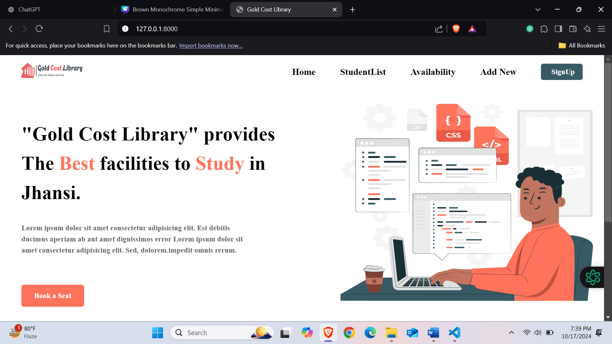
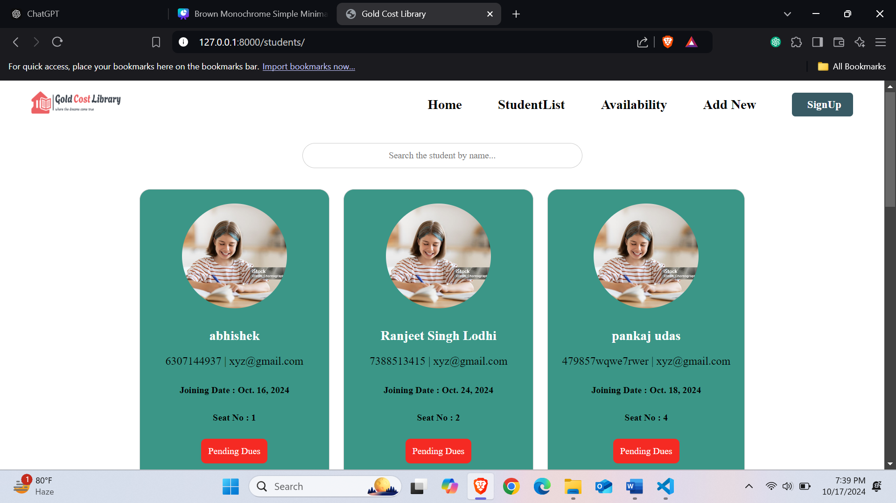
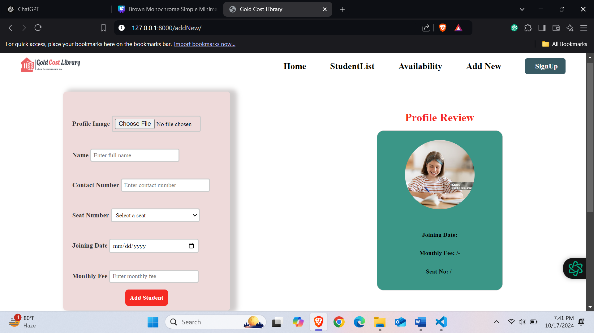
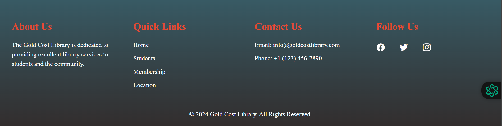

# Gold Cost Library

A comprehensive library management system built with Django. The Gold Cost Library streamlines library operations by providing features to manage student records, send fee reminders, and dynamically grow as the number of students increases. This project is designed for library administrators to efficiently manage student information and operations.

---

## Features

- **Homepage**: Welcomes users and provides an overview of the library.
- **Student Section**: Displays detailed student information, including profile images, contact information, and fee status.
- **Admin Section**: Allows administrators to manage student records dynamically, add new students, and send automatic reminders for fee payments.
- **Fee Management**: Enables seamless reminders for students who haven’t paid their fees.
- **Responsive Design**: Ensures the website looks great on all devices.

---

## Screenshots

### Homepage


### Student Section
Displays a table of all students with their details such as profile image, name, joining date, contact number, and fee status.



### AddNew Section
Admin can dynamically add, update, or delete student records. The interface also allows sending fee reminders.



### Footer Section
In the footer section you can find the different navigation links ans contact details.



---

## Tech Stack

- **Backend**: Django (Python)
- **Frontend**: HTML, CSS, JavaScript (Bootstrap for responsiveness)
- **Database**: SQLite (default Django database)

---

## Installation

Follow these steps to set up the project locally:

1. **Clone the Repository**:
   ```bash
   git clone https://github.com/yourusername/gold-cost-library.git
   cd gold-cost-library
   ```

2. **Install Dependencies**:
   ```bash
   pip install -r requirements.txt
   ```

3. **Apply Migrations**:
   ```bash
   python manage.py migrate
   ```

4. **Run the Server**:
   ```bash
   python manage.py runserver
   ```

5. **Access the Application**: Open `http://127.0.0.1:8000/` in your web browser.

---

## How to Use

### Admin Access
1. Navigate to the admin login page: `/admin/`
2. Log in with your admin credentials.
3. Manage student records and send reminders.

### Students Access
1. Students can view their information in a read-only mode.
2. Fee payment reminders will provide a direct link for online payment.

---

## Folder Structure

```
GoldCostLibrary/
|— manage.py
|— db.sqlite3
|— assets/
    |— images/
        |— homepage.png
        |— student_section.png
        |— admin_section.png
|— templates/
    |— base.html
    |— header.html
    |— footer.html
    |— home.html
    |— student_section.html
|— static/
    |— css/
        |— style.css
    |— js/
        |— script.js
|— GoldCostLibraryApp/
    |— views.py
    |— models.py
    |— urls.py
```

---

## Contributions

Contributions are welcome! Feel free to submit a pull request or report any issues.

---

## License

This project is licensed under the Abhishek 

---

## Contact

For any queries or support, contact:

- **Name**: Abhishek Rajpoot
- **Email**: dev.abhishek.rajpoot@gmail.com
- **GitHub**: [Your GitHub Profile](https://github.com/DeveloperAbhishekRajpoot)

---

Happy Coding! 🚀
